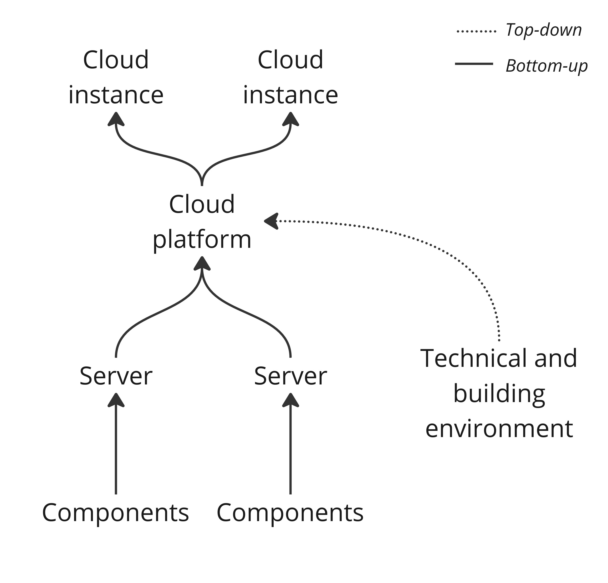

# BoaviztAPI: A Bottom-Up Model to Assess the Environmental Impacts of Cloud Services

This repository contains a ready-to-use Jupyer Notebook implementation of the methodological approach proposed in the paper *BoaviztAPI: A Bottom-Up Model to Assess the Environmental Impacts of Cloud Services*.

To use the notebook [boaviztapi.ipynb](./boaviztapi.ipynb), create your venv and install the pip requirements:

```python
python3 -m venv venv
source venv/bin/activate
pip install -r requirements.txt
```

The approach follows a bottom-approach from component's servers to create a cloud platform that is allocated to individual cloud instances:

